# 1. 环境配置

## 1.1. jittor环境配置

使用`conda`建立一个新环境，`python`选取3.8版本：

```
conda create -n jittor python=3.8
```

下载`jittor`：

```
pip install jittor
```

设置内存分配策略：

```
sudo sysctl vm.overcommit_memory=1
```

## 1.2.  pytorch环境配置（复现）

`conda`新建环境：

```
conda create -n SINet python=3.6
```

配置`pytorch`：

```
conda install pytorch==1.11.0 torchvision==0.12.0 torchaudio==0.11.0 cudatoolkit=11.3
```

配置所需库：

```
pip install opencv-python-headless

 pip install thop -i https://pypi.tuna.tsinghua.edu.cn/simple

 pip install tensorboardX -i https://pypi.tuna.tsinghua.edu.cn/simple
```

# 2. 数据准备脚本

## 2.0. 数据集获取

本项目是`SINet-V2`网络的跨框架实现，包含**`PyTorch`框架复现**及**`Jittor`训练框架原生实现**。数据集需从原始`SINet-V2`仓库获取：[GewelsJI/SINet-V2: Concealed Object Detection (SINet-V2, IEEE TPAMI 2022). Code is implemented by PyTorch/Jittor frameworks.](https://github.com/GewelsJI/SINet-V2?tab=readme-ov-file)

## 2.1. 小数据样本划分

为在小数据集上快速验证代码的可运行，构建了简化版数据集：训练验证集从原始img文件夹随机抽取10%图像，并在GT文件夹复制对应标注文件；测试集中，CAMO和CHAMELEON数据集完整保留，COD10K数据集按类别分层抽样（每类抽取10%图像）并复制对应GT/EDGE标注，NC4K数据集随机抽取10%图像并复制对应GT/Instance标注。所有子集均保持与原数据集相同的目录结构。数据准备代码脚本位于`.\SINet-V2\jittor_lib\utils\data_split.py`。

```
import os
import shutil
import random

source_dir = '/tmp/pycharm_project_692/Dataset'
target_dir = 'SmallDataset1'


def create_directory_structure():

    os.makedirs(os.path.join(target_dir, 'TrainValDataset', 'Imgs'), exist_ok=True)
    os.makedirs(os.path.join(target_dir, 'TrainValDataset', 'GT'), exist_ok=True)

    for subdir in ['Imgs', 'GT', 'Edge']:
        os.makedirs(os.path.join(target_dir, 'TestDataset', 'CAMO', subdir), exist_ok=True)

    for subdir in ['Imgs', 'GT', 'Edge']:
        os.makedirs(os.path.join(target_dir, 'TestDataset', 'CHAMELEON', subdir), exist_ok=True)

    for subdir in ['Imgs', 'GT', 'Edge']:
        os.makedirs(os.path.join(target_dir, 'TestDataset', 'COD10K', subdir), exist_ok=True)

    for subdir in ['Imgs', 'GT', 'Instance']:
        os.makedirs(os.path.join(target_dir, 'TestDataset', 'NC4K', subdir), exist_ok=True)


def process_trainval():
    src_imgs = os.path.join(source_dir, 'TrainValDataset', 'Imgs')
    src_gt = os.path.join(source_dir, 'TrainValDataset', 'GT')

    dst_imgs = os.path.join(target_dir, 'TrainValDataset', 'Imgs')
    dst_gt = os.path.join(target_dir, 'TrainValDataset', 'GT')

    all_images = [f for f in os.listdir(src_imgs) if os.path.isfile(os.path.join(src_imgs, f))]
    selected_images = random.sample(all_images, max(1, int(len(all_images) * 0.1)))

    for img in selected_images:
        img_path = os.path.join(src_imgs, img)
        shutil.copy2(img_path, dst_imgs)

        gt_name = os.path.splitext(img)[0] + '.png'
        gt_path = os.path.join(src_gt, gt_name)
        if os.path.exists(gt_path):
            shutil.copy2(gt_path, dst_gt)


def process_cod10k():
    src_imgs = os.path.join(source_dir, 'TestDataset', 'COD10K', 'Imgs')
    src_gt = os.path.join(source_dir, 'TestDataset', 'COD10K', 'GT')
    src_edge = os.path.join(source_dir, 'TestDataset', 'COD10K', 'Edge')

    dst_imgs = os.path.join(target_dir, 'TestDataset', 'COD10K', 'Imgs')
    dst_gt = os.path.join(target_dir, 'TestDataset', 'COD10K', 'GT')
    dst_edge = os.path.join(target_dir, 'TestDataset', 'COD10K', 'Edge')

    category_images = {}
    for img in os.listdir(src_imgs):
        if os.path.isfile(os.path.join(src_imgs, img)):
            parts = img.split('-')
            if len(parts) > 1:
                category = parts[-2]
                category_images.setdefault(category, []).append(img)

    for category, images in category_images.items():
        num_to_select = max(1, int(len(images) * 0.1))
        selected_images = random.sample(images, num_to_select)

        for img in selected_images:
            img_path = os.path.join(src_imgs, img)
            shutil.copy2(img_path, dst_imgs)

            base_name = os.path.splitext(img)[0]
            for ext in ['.png', '.jpg']:
                gt_path = os.path.join(src_gt, base_name + ext)
                if os.path.exists(gt_path):
                    shutil.copy2(gt_path, dst_gt)
                    break

            for ext in ['.png', '.jpg']:
                edge_path = os.path.join(src_edge, base_name + ext)
                if os.path.exists(edge_path):
                    shutil.copy2(edge_path, dst_edge)
                    break


def process_nc4k():
    src_imgs = os.path.join(source_dir, 'TestDataset', 'NC4K', 'Imgs')
    src_gt = os.path.join(source_dir, 'TestDataset', 'NC4K', 'GT')
    src_instance = os.path.join(source_dir, 'TestDataset', 'NC4K', 'Instance')

    dst_imgs = os.path.join(target_dir, 'TestDataset', 'NC4K', 'Imgs')
    dst_gt = os.path.join(target_dir, 'TestDataset', 'NC4K', 'GT')
    dst_instance = os.path.join(target_dir, 'TestDataset', 'NC4K', 'Instance')

    all_images = [f for f in os.listdir(src_imgs) if os.path.isfile(os.path.join(src_imgs, f))]
    selected_images = random.sample(all_images, max(1, int(len(all_images) * 0.1)))

    for img in selected_images:
        img_path = os.path.join(src_imgs, img)
        shutil.copy2(img_path, dst_imgs)

        base_name = os.path.splitext(img)[0]

        for ext in ['.png', '.jpg']:
            gt_path = os.path.join(src_gt, base_name + ext)
            if os.path.exists(gt_path):
                shutil.copy2(gt_path, dst_gt)
                break

        for ext in ['.png', '.jpg', '.txt']:
            instance_path = os.path.join(src_instance, base_name + ext)
            if os.path.exists(instance_path):
                shutil.copy2(instance_path, dst_instance)
                break


def copy_full_directory(src, dst):
    if os.path.exists(src):
        if not os.path.exists(dst):
            shutil.copytree(src, dst)
        else:
            for item in os.listdir(src):
                src_item = os.path.join(src, item)
                dst_item = os.path.join(dst, item)
                if os.path.isdir(src_item):
                    shutil.copytree(src_item, dst_item, dirs_exist_ok=True)
                else:
                    shutil.copy2(src_item, dst_item)


def main():
    create_directory_structure()

    print("Processing TrainValDataset...")
    process_trainval()

    print("Processing CAMO...")
    copy_full_directory(
        os.path.join(source_dir, 'TestDataset', 'CAMO'),
        os.path.join(target_dir, 'TestDataset', 'CAMO')
    )

    print("Processing CHAMELEON...")
    copy_full_directory(
        os.path.join(source_dir, 'TestDataset', 'CHAMELEON'),
        os.path.join(target_dir, 'TestDataset', 'CHAMELEON')
    )

    print("Processing COD10K...")
    process_cod10k()

    print("Processing NC4K...")
    process_nc4k()

    print("\nSmall dataset creation completed successfully!")
    print(f"Small dataset saved to: {target_dir}")


if __name__ == "__main__":
    main()
```

## 2.2. 数据增强模块

在训练之前，对训练集数据进行了随机翻转、裁剪、旋转、颜色增强、掩码加噪等变换处理。变换定义函数如下：

```
def cv_random_flip(img, label):
    flip_flag = random.randint(0, 1)
    if (flip_flag == 1):
        img = img.transpose(Image.FLIP_LEFT_RIGHT)
        label = label.transpose(Image.FLIP_LEFT_RIGHT)
    return (img, label)


def randomCrop(image, label):
    border = 30
    image_width = image.size[0]
    image_height = image.size[1]
    crop_win_width = np.random.randint((image_width - border), image_width)
    crop_win_height = np.random.randint((image_height - border), image_height)
    random_region = (((image_width - crop_win_width) >> 1), ((image_height - crop_win_height) >> 1), ((image_width + crop_win_width) >> 1), ((image_height + crop_win_height) >> 1))
    return (image.crop(random_region), label.crop(random_region))


def randomRotation(image, label):
    mode = Image.BICUBIC
    if (random.random() > 0.8):
        random_angle = np.random.randint((- 15), 15)
        image = image.rotate(random_angle, mode)
        label = label.rotate(random_angle, mode)
    return (image, label)


def colorEnhance(image):
    bright_intensity = (random.randint(5, 15) / 10.0)
    image = ImageEnhance.Brightness(image).enhance(bright_intensity)
    contrast_intensity = (random.randint(5, 15) / 10.0)
    image = ImageEnhance.Contrast(image).enhance(contrast_intensity)
    color_intensity = (random.randint(0, 20) / 10.0)
    image = ImageEnhance.Color(image).enhance(color_intensity)
    sharp_intensity = (random.randint(0, 30) / 10.0)
    image = ImageEnhance.Sharpness(image).enhance(sharp_intensity)
    return image


def randomGaussian(image, mean=0.1, sigma=0.35):

    def gaussianNoisy(im, mean=mean, sigma=sigma):
        for _i in range(len(im)):
            im[_i] += random.gauss(mean, sigma)
        return im
    img = np.asarray(image)
    (width, height) = img.shape
    img = gaussianNoisy(img[:].flatten(), mean, sigma)
    img = img.reshape([width, height])
    return Image.fromarray(np.uint8(img))


def randomPeper(img):
    img = np.array(img)
    noiseNum = int(((0.0015 * img.shape[0]) * img.shape[1]))
    for i in range(noiseNum):
        randX = random.randint(0, (img.shape[0] - 1))
        randY = random.randint(0, (img.shape[1] - 1))
        if (random.randint(0, 1) == 0):
            img[(randX, randY)] = 0
        else:
            img[(randX, randY)] = 255
    return Image.fromarray(img)
```

在`PolypObjDataset`类中进行了调用，具体调用如下：

```
def __getitem__(self, index):
    image = self.rgb_loader(self.images[index])
    gt = self.binary_loader(self.gts[index])
    (image, gt) = cv_random_flip(image, gt)
    (image, gt) = randomCrop(image, gt)
    (image, gt) = randomRotation(image, gt)
    image = colorEnhance(image)
    gt = randomPeper(gt)
```

## 2.3. 数据加载模块

### 2.3.1 训练数据加载

训练数据加载模块脚本如下，存储于`.\SINet-V2\jittor_lib\MyTraning.py`中。

```
train_loader = get_loader(image_root=opt.train_root + 'Imgs/',
                          gt_root=opt.train_root + 'GT/',
                          batchsize=opt.batchsize,
                          trainsize=opt.trainsize,
                          num_workers=8)
```

### 2.3.2 验证数据加载

验证数据加载模块脚本如下，存储于`.\SINet-V2\jittor_lib\MyTraning.py`中。

```
val_loader = test_dataset(image_root=opt.val_root + 'Imgs/',
                          gt_root=opt.val_root + 'GT/',
                          testsize=opt.trainsize)
```

### 2.3.3 测试数据集加载

测试数据加载模块脚本如下，存储于`.\SINet-V2\jittor_lib\MyTesting.py`中。其中`data_path`代表数据集路径，可根据自己的情况进行更换。

```
for _data_name in ['CAMO', 'COD10K', 'CHAMELEON','NC4K']:
    data_path = './SmallDataset1/TestDataset/{}/'.format(_data_name)
    save_path = './res_small_pytorch_pth/{}/{}/'.format(opt.pth_path.split('/')[-2], _data_name)
```

# 3. 训练脚本

训练脚本如下，存储于`.\SINet-V2\jittor_lib\MyTraning.py`中。

```
import os
import jittor as jt
import jittor.nn as nn
import numpy as np
from datetime import datetime
from utils.data_val import get_loader, test_dataset
from utils.utils import clip_gradient, adjust_lr
from tensorboardX import SummaryWriter
import logging
from lib.Network_Res2Net_GRA_NCD import Network


jt.flags.use_cuda = 1
jt.flags.log_silent = True


def structure_loss(pred, mask):
    weit = 1 + 5 * jt.abs(nn.avg_pool2d(mask, kernel_size=31, stride=1, padding=15) - mask)
    wbce = nn.binary_cross_entropy_with_logits(pred, mask)
    wbce = (weit * wbce).sum(2, 3) / weit.sum(2, 3)

    pred = jt.sigmoid(pred)
    inter = ((pred * mask) * weit).sum(2, 3)
    union = ((pred + mask) * weit).sum(2, 3)
    wiou = 1 - (inter + 1) / (union - inter + 1)
    return (wbce + wiou).mean()


def train(train_loader, model, optimizer, epoch, save_path, writer):
    global step
    model.train()
    loss_all = 0
    epoch_step = 0
    try:
        for i, (images, gts) in enumerate(train_loader, start=1):
            optimizer.zero_grad()

            images = images.float32()
            gts = gts.float32()

            preds = model(images)
            loss_init = structure_loss(preds[0], gts) + structure_loss(preds[1], gts) + structure_loss(preds[2], gts)
            loss_final = structure_loss(preds[3], gts)
            loss = loss_init + loss_final

            optimizer.backward(loss)

            clip_gradient(optimizer, opt.clip)
            optimizer.step()

            step += 1
            epoch_step += 1
            loss_all += loss.item()

            if i % 20 == 0 or i == total_step or i == 1:
                print('{} Epoch [{:03d}/{:03d}], Step [{:04d}/{:04d}], Total_loss: {:.4f} Loss1: {:.4f} Loss2: {:0.4f}'.
                      format(datetime.now(), epoch, opt.epoch, i, total_step, loss.item(), loss_init.item(),loss_final.item()))
                logging.info(
                    '[Train Info]:Epoch [{:03d}/{:03d}], Step [{:04d}/{:04d}], Total_loss: {:.4f} Loss1: {:.4f} '
                    'Loss2: {:0.4f}'.
                    format(epoch, opt.epoch, i, total_step, loss.item(), loss_init.item(), loss_final.item()))

                writer.add_scalars('Loss_Statistics',
                                   {'Loss_init': loss_init.item(), 'Loss_final': loss_final.item(),
                                    'Loss_total': loss.item()},
                                   global_step=step)


                rgb_img = images[0].numpy().transpose(1, 2, 0)  # CHW -> HWC
                writer.add_image('RGB', rgb_img, step, dataformats='HWC')
                gt_img = gts[0].numpy().squeeze()
                writer.add_image('GT', gt_img, step, dataformats='HW')

                res = preds[0][0].sigmoid().numpy().squeeze()
                res = (res - res.min()) / (res.max() - res.min() + 1e-8)
                writer.add_image('Pred_init', res, step, dataformats='HW')
                res = preds[3][0].sigmoid().numpy().squeeze()
                res = (res - res.min()) / (res.max() - res.min() + 1e-8)
                writer.add_image('Pred_final', res, step, dataformats='HW')

        loss_all /= epoch_step
        logging.info('[Train Info]: Epoch [{:03d}/{:03d}], Loss_AVG: {:.4f}'.format(epoch, opt.epoch, loss_all))
        writer.add_scalar('Loss-epoch', loss_all, global_step=epoch)
        if epoch % 50 == 0:
            jt.save(model.state_dict(), save_path + 'Net_epoch_{}.pkl'.format(epoch))
    except KeyboardInterrupt:
        print('Keyboard Interrupt: save model and exit.')
        if not os.path.exists(save_path):
            os.makedirs(save_path)
        jt.save(model.state_dict(), save_path + 'Net_epoch_{}.pkl'.format(epoch + 1))
        print('Save checkpoints successfully!')
        raise


def val(test_loader, model, epoch, save_path, writer):
    global best_mae, best_epoch
    model.eval()
    with jt.no_grad():
        mae_sum = 0
        for i in range(test_loader.size):
            image, gt, name, _ = test_loader[i]

            gt = np.asarray(gt, np.float32)
            gt /= (gt.max() + 1e-8)

            image = jt.array(image) 

            if image.ndim == 3: 
                image = image.unsqueeze(0) 

            image = image.float32()

            res = model(image)

            res = nn.interpolate(res[3], size=gt.shape, mode='bilinear', align_corners=False)
            res = res.sigmoid().squeeze().numpy()
            res = (res - res.min()) / (res.max() - res.min() + 1e-8)
            mae_sum += np.sum(np.abs(res - gt)) * 1.0 / (gt.shape[0] * gt.shape[1])
        mae = mae_sum / test_loader.size
        writer.add_scalar('MAE', mae, global_step=epoch)
        print('Epoch: {}, MAE: {}, bestMAE: {}, bestEpoch: {}.'.format(epoch, mae, best_mae, best_epoch))
        if epoch == 1:
            best_mae = mae
        else:
            if mae < best_mae:
                best_mae = mae
                best_epoch = epoch
                jt.save(model.state_dict(), save_path + 'Net_epoch_best.pkl')
                print('Save state_dict successfully! Best epoch:{}.'.format(epoch))

        logging.info(
            '[Val Info]:Epoch:{} MAE:{} bestEpoch:{} bestMAE:{}'.format(epoch, mae, best_epoch, best_mae))


if __name__ == '__main__':
    import argparse

    parser = argparse.ArgumentParser()
    parser.add_argument('--epoch', type=int, default=100, help='epoch number')
    parser.add_argument('--lr', type=float, default=1e-4, help='learning rate')
    parser.add_argument('--batchsize', type=int, default=18, help='training batch size')
    parser.add_argument('--trainsize', type=int, default=352, help='training dataset size')
    parser.add_argument('--clip', type=float, default=0.5, help='gradient clipping margin')
    parser.add_argument('--decay_rate', type=float, default=0.1, help='decay rate of learning rate')
    parser.add_argument('--decay_epoch', type=int, default=50, help='every n epochs decay learning rate')
    parser.add_argument('--load', type=str, default=None, help='train from checkpoints')
    parser.add_argument('--gpu_id', type=str, default='0', help='train use gpu')
    parser.add_argument('--train_root', type=str, default='./SmallDataset1/TrainValDataset/',
                        help='the training rgb images root')
    parser.add_argument('--val_root', type=str, default='./SmallDataset1/TestDataset/CAMO/',
                        help='the test rgb images root')
    parser.add_argument('--save_path', type=str,
                        default='./snapshot_jittor/SINet_V2/',
                        help='the path to save model and log')
    opt = parser.parse_args()

    print(f'USE GPU {opt.gpu_id}')


    model = Network(channel=32)

    if opt.load is not None:
        model.load_state_dict(jt.load(opt.load))
        print('load model from ', opt.load)

    optimizer = nn.Adam(model.parameters(), opt.lr)

    save_path = opt.save_path
    if not os.path.exists(save_path):
        os.makedirs(save_path)

    if jt.in_mpi:
        jt.world_size = jt.mpi.world_size()
        jt.rank = jt.mpi.rank()
    else:
        jt.world_size = 1
        jt.rank = 0

    print('load data...')
    train_loader = get_loader(image_root=opt.train_root + 'Imgs/',
                              gt_root=opt.train_root + 'GT/',
                              batchsize=opt.batchsize,
                              trainsize=opt.trainsize,
                              num_workers=8)

    if jt.world_size > 1:
        train_loader = train_loader.set_attrs(
            num_workers=8,
            batch_size=opt.batchsize // jt.world_size,
            shuffle=True,
            drop_last=True
        )

    val_loader = test_dataset(image_root=opt.val_root + 'Imgs/',
                              gt_root=opt.val_root + 'GT/',
                              testsize=opt.trainsize)
    total_step = len(train_loader)


    logging.basicConfig(filename=save_path + 'log.log',
                        format='[%(asctime)s-%(filename)s-%(levelname)s:%(message)s]',
                        level=logging.INFO, filemode='a', datefmt='%Y-%m-%d %I:%M:%S %p')
    logging.info("Network-Train")
    logging.info('Config: epoch: {}; lr: {}; batchsize: {}; trainsize: {}; clip: {}; decay_rate: {}; load: {}; '
                 'save_path: {}; decay_epoch: {}'.format(opt.epoch, opt.lr, opt.batchsize, opt.trainsize, opt.clip,
                                                         opt.decay_rate, opt.load, save_path, opt.decay_epoch))

    step = 0
    writer = SummaryWriter(save_path + 'summary')
    best_mae = 1
    best_epoch = 0

    print("Start train...")
    for epoch in range(1, opt.epoch+1):
        cur_lr = adjust_lr(optimizer, opt.lr, epoch, opt.decay_rate, opt.decay_epoch)
        writer.add_scalar('learning_rate', cur_lr, global_step=epoch)
        train(train_loader, model, optimizer, epoch, save_path, writer)
        val(val_loader, model, epoch, save_path, writer)
```

# 4. 测试脚本

测试脚本如下，存储于`.\SINet-V2\jittor_lib\MyTesting.py`中。

```
import os, argparse, imageio
import numpy as np

import jittor as jt
from jittor import nn

from lib.Network_Res2Net_GRA_NCD import Network
from utils.data_val import test_dataset

jt.flags.use_cuda = 1

parser = argparse.ArgumentParser()
parser.add_argument('--testsize', type=int, default=352, help='testing size')
parser.add_argument('--pth_path', type=str, default='./snapshot_jittor/SINet_V2/Net_epoch_best.pkl')
opt = parser.parse_args()


for _data_name in ['CAMO', 'COD10K', 'CHAMELEON', 'NC4K']:
    data_path = './SmallDataset1/TestDataset/{}/'.format(_data_name)
    save_path = './res_jittor_pkl_small/{}/{}/'.format(opt.pth_path.split('/')[(- 2)], _data_name)
    model = Network()
    model.load(opt.pth_path)
    model.eval()

    os.makedirs(save_path, exist_ok=True)
    image_root = '{}/Imgs/'.format(data_path)
    gt_root = '{}/GT/'.format(data_path)
    test_loader = test_dataset(image_root, gt_root, opt.testsize)\
        .set_attrs(batch_size=1, shuffle=False)

    for image, gt, name, _ in test_loader:
        gt /= (gt.max() + 1e-08)
        (res5, res4, res3, res2) = model(image)

        res = res2
        c, h, w = gt.shape
        res = nn.upsample(res, size=(h, w), mode='bilinear')
        res = res.sigmoid().data.squeeze()
        res = ((res - res.min()) / ((res.max() - res.min()) + 1e-08))
        print('> {} - {}'.format(_data_name, name))


        if res.dtype == np.float32 or res.dtype == np.float64:
            if res.max() <= 1.0:
                res = (res * 255).astype(np.uint8)
            else:
                res = np.clip(res, 0, 255).astype(np.uint8)  


        imageio.imwrite((save_path + name[0]), res)
```

# 5. 实验log

在本部分工作中，我完成了 `SINet_V2` 模型的 `PyTorch` 版本复现，并在自定义抽取的小规模数据集上实现了 `Jittor` 版本。实验中发现两个版本的评估指标存在显著差异。为探究数据集规模对模型性能的影响，我进一步开展了对照实验：使用小规模数据集配合 `PyTorch` 框架进行训练，以及使用原始数据集配合 Jittor 框架进行训练，后者受限于算力资源仅训练了 30 个轮次。下文将基于 `learning_rate`、 `loss_epoch`、`Loss_Statistics`、`MAE` 四个训练日志维度，分别展示原始数据集与小规模数据集、以及 PyTorch 与 Jittor 框架组合下的实验结果。

## 5.1. 基于原始数据集的实验

### 5.1.1. pytorch复现实验log

`learning_rate`

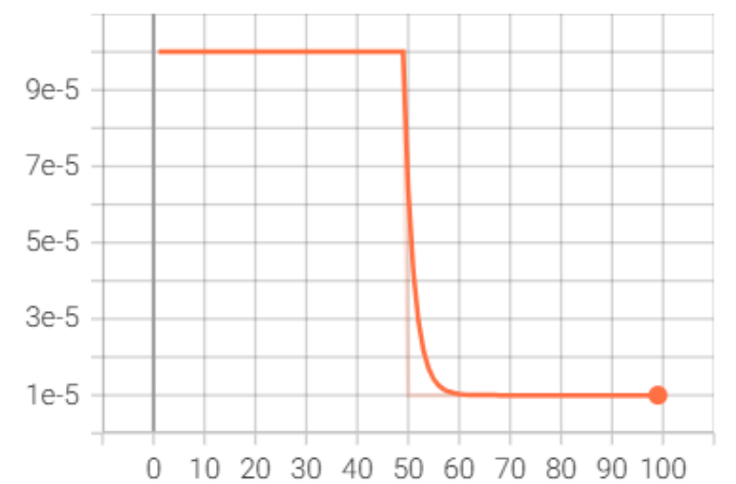

 `loss_epoch`

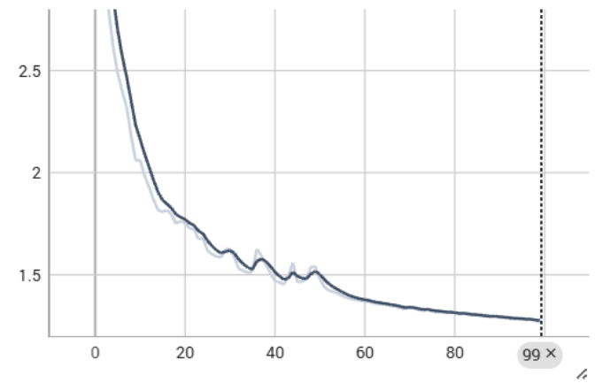

`Loss_Statistics`

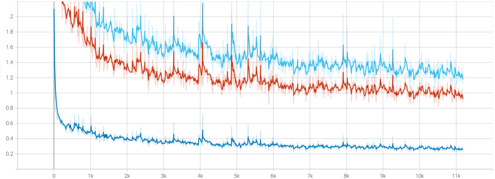

`MAE`

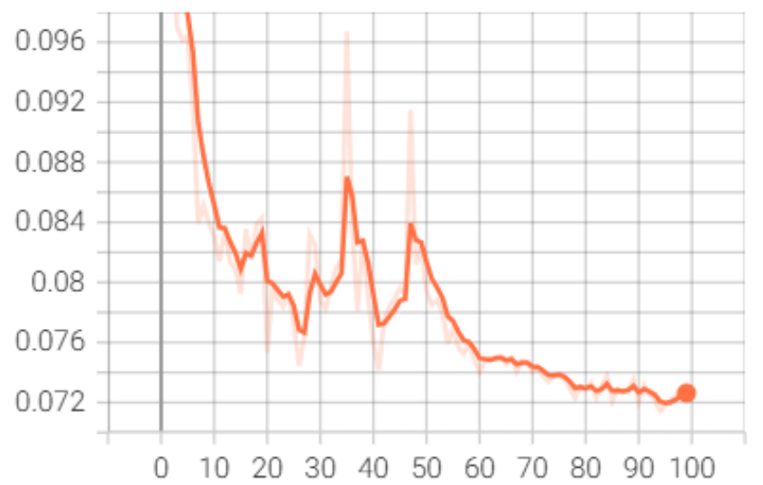


### 5.1.2.  jittor实现实验log

`learning_rate`

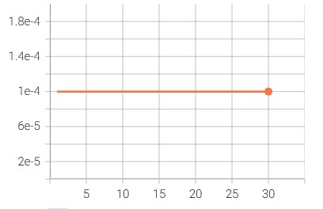

`loss_epoch`

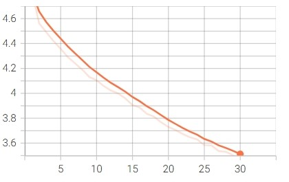

`Loss_Statistics`

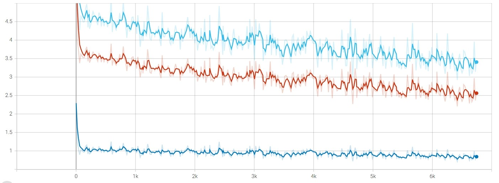

`MAE`

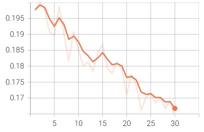

## 5.2. 基于小数据集的实验

### 5.2.1. pytorch复现实验log

`learning_rate`

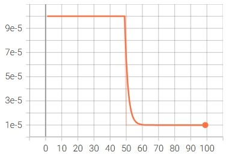

 `loss_epoch`

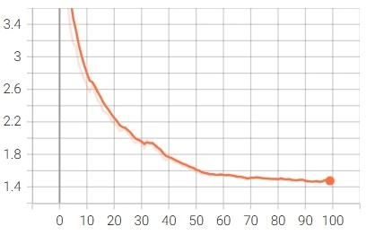

`Loss_Statistics`

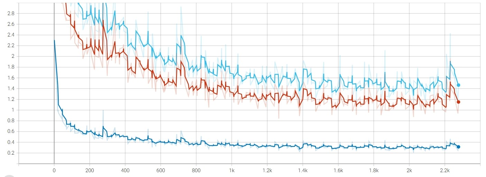

`MAE`

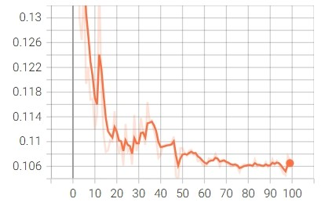

### 5.2.2. jittor实现实验log

`learning_rate`


`loss_epoch`


`Loss_Statistics`


`MAE`


# 6. 性能log

## 6.1. 基于原始数据集的测试

| CHAMELEON dataset | S-measure | E-measure | F-measure |   M   |
| :---------------: | :-------: | :-------: | :-------: | :---: |
|      PyTorch      |   0.891   |   0.944   |   0.821   | 0.028 |
|      Jittor       |   0.674   |   0.668   |   0.410   | 0.123 |

| CAMO-Test dataset | S-measure | E-measure | F-measure |   M   |
| :---------------: | :-------: | :-------: | :-------: | :---: |
|      PyTorch      |   0.824   |   0.881   |   0.751   | 0.071 |
|      Jittor       |   0.621   |   0.610   |   0.375   | 0.163 |

| COD10K-Test dataset | S-measure | E-measure | F-measure |   M   |
| :-----------------: | :-------: | :-------: | :-------: | :---: |
|       PyTorch       |   0.813   |   0.885   |   0.676   | 0.037 |
|       Jittor        |   0.628   |   0.630   |   0.308   | 0.108 |

| NC4K dataset | S-measure | E-measure | F-measure |   M   |
| :----------: | :-------: | :-------: | :-------: | :---: |
|   PyTorch    |   0.847   |   0.903   |   0.770   | 0.047 |
|    Jittor    |   0.672   |   0.665   |   0.428   | 0.128 |

## 6.2. 基于小数据集的测试

| CHAMELEON dataset | S-measure | E-measure | F-measure |   M   |
| :---------------: | :-------: | :-------: | :-------: | :---: |
|      PyTorch      |   0.809   |   0.874   |   0.682   | 0.054 |
|      Jittor       |   0.613   |   0.589   |   0.307   | 0.160 |

| CAMO-Test dataset | S-measure | E-measure | F-measure |   M   |
| :---------------: | :-------: | :-------: | :-------: | :---: |
|      PyTorch      |   0.739   |   0.793   |   0.612   | 0.104 |
|      Jittor       |   0.578   |   0.559   |   0.298   | 0.187 |

| COD10K-Test dataset | S-measure | E-measure | F-measure |   M   |
| :-----------------: | :-------: | :-------: | :-------: | :---: |
|       PyTorch       |   0.751   |   0.824   |   0.567   | 0.057 |
|       Jittor        |   0.574   |   0.564   |   0.230   | 0.147 |

| NC4K dataset | S-measure | E-measure | F-measure |   M   |
| :----------: | :-------: | :-------: | :-------: | :---: |
|   PyTorch    |   0.804   |   0.871   |   0.687   | 0.057 |
|    Jittor    |   0.607   |   0.584   |   0.305   | 0.151 |
